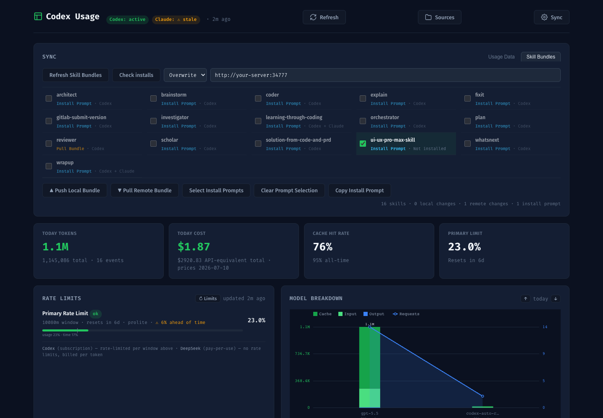

# Codex Usage Dashboard

本地 Codex + Claude Code 使用量仪表盘。它会直接读取本机的 JSONL 日志，汇总 token、请求次数、模型、项目、会话、费用估算、速率限制和 Skills/MCP 使用情况，并提供一个零依赖的 Web 页面查看结果。



## MVP Release

`v0.2.0-mvp` 是一个源码版 MVP release：Codex Usage Dashboard 已经覆盖 usage、cost、rate limits、sources、model / project / session breakdown，以及跨设备 usage snapshot 和 Skill Bundles 同步。当前仓库没有发布 npm 包或二进制安装包，推荐通过 Git tag 拉取源码运行。

## 适合做什么

- 查看今天和历史的 Codex / Claude Code token 消耗、请求次数和缓存命中情况。
- 按模型、项目、会话和运行环境拆分使用量。
- 查看 Codex 当前账号的 rate limit 状态、重置时间和最近会话 burn rate。
- 估算 API 等价费用，并支持按模型覆盖价格表。
- 管理本机、WSL、Claude Code、额外 Codex Home 等多个数据源。
- 通过中心服务器同步多台设备的快照，并在本地合并展示。
- 同步可移植的 Skills Markdown 源目录，比较本地、远端和已安装状态。

## 特性

- **零外部 npm 依赖**：运行时只依赖 Node.js 标准库。
- **双 Agent 数据源**：解析 Codex `sessions` / `archived_sessions` 和 Claude Code `projects` 下的 JSONL 日志。
- **多环境识别**：自动识别 Windows、macOS、Linux 和 Windows 上的 WSL Codex Home。
- **交互式 Web 仪表盘**：包含关键指标、趋势图、月度热力图、模型拆分、项目排行、会话排行、环境统计、Skills & MCP 统计。
- **快照与解析缓存**：Web/TUI 会立即显示已有快照并在后台刷新；运行期间只解析 JSONL 新增字节，检测到截断或改写时自动回退到全量解析。
- **多设备同步**：支持 push / pull 快照到一个兼容的 Dashboard Server，并在页面中合并远端设备数据。
- **Skills 同步**：支持注册 Skills 源目录、生成 bundle、推送/拉取远端 bundle，并为 Codex 生成安装提示词。
- **费用估算**：内置部分模型价格表，可在 `~/.codex-usage.json` 中覆盖或关闭。

## 快速开始

要求：

- Node.js `>= 20`
- 本机已有 Codex 或 Claude Code 日志

无头服务器或纯终端环境直接运行：

```bash
node src/cli.js
# 或
npm run cli
```

这两个入口都会打开持续运行的彩色全屏终端菜单：程序进入备用屏幕，切换子菜单时整页重绘，退出后恢复原来的终端内容。使用 `↑` / `↓` 移动高亮项，按 Enter 进入，按 Esc 返回；操作完成后按 Enter 回到主菜单。在主菜单选择 `Exit` 或按 Esc 会恢复终端并立即结束进程。菜单中可查看/推拉 usage、管理 Skills，以及一次性保存同步服务器和 token。后续命令会自动读取保存的连接信息，不必重复传入多个参数。设置 `NO_COLOR=1` 可以关闭 ANSI 颜色，`FORCE_COLOR=1` 可以强制开启。

首次启动时，如果发现尚未注册且包含 JSONL 日志的默认 Codex / Claude 数据目录，TUI 会列出路径和文件数，确认后才把这些目录写入配置并开始统计。Usage 和 Skill Bundle 的 Push/Pull 页面会依次显示 `Working`、`Done`、`Done with warnings` 或 `Failed` 状态。

Usage 读取采用 stale-while-revalidate：存在 `state/latest.json` 时，Web 和 TUI 会先显示已有数据，再在后台检查并刷新过期快照。JSONL 文件缓存按大小、修改时间和尾部签名校验；纯追加文件只解析新增字节，文件被截断、覆盖或筛选条件变化时会自动执行完整解析。显式 Refresh 和 Push 仍等待最新快照完成，以保证写出或上传的数据一致；退出 TUI 会取消仍在运行的后台扫描。Web 的实时 Rate Limits 通过独立的 `/api/limits` 操作刷新，TUI 使用 JSONL 中最近记录的限制信息，两者都不再阻塞 usage 快照生成。

启动 Web 仪表盘：

```bash
node src/cli.js web
```

浏览器打开：

```text
http://127.0.0.1:34777
```

也可以指定端口和绑定地址：

```bash
node src/cli.js web --port 34777 --bind 127.0.0.1
```

## npm 脚本

```bash
npm test
npm start
npm run web
npm run snapshot
npm run cli
npm run summary
npm run configure
npm run push
npm run pull
npm run register -- --path /path/to/.codex --type codex --label work
```

## CLI 命令

| 命令 | 说明 |
| --- | --- |
| `node src/cli.js` | 打开交互式终端菜单（推荐） |
| `node src/cli.js cli` / `npm run cli` | 打开同一个交互式终端菜单 |
| `node src/cli.js configure` | 交互式保存同步服务器和 token；token 输入不回显 |
| `node src/cli.js web [--port 34777] [--bind 127.0.0.1] [--no-wsl]` | 启动本地 Web 仪表盘 |
| `node src/cli.js snapshot [--since YYYYMMDD] [--until YYYYMMDD] [--state state/latest.json]` | 生成快照 JSON |
| `node src/cli.js summary [--json] [--since YYYYMMDD] [--until YYYYMMDD] [--no-wsl]` | 非交互地打印本机与已同步设备的聚合摘要；只读取本地副本，不会隐式拉取远端 |
| `node src/cli.js push [--device <name>]` | 使用已保存连接把本机快照推送到同步服务器 |
| `node src/cli.js pull` | 使用已保存连接从同步服务器拉取其他设备快照 |
| `node src/cli.js register --path <dir> --type codex\|claude\|skills [--label <name>]` | 注册自定义数据目录或 Skills 源目录 |
| `node src/cli.js skills` | 打开交互式 Skills 菜单 |
| `node src/cli.js skills list [--json]` | 使用已保存连接比较本地、远端和已安装 Skills |
| `node src/cli.js skills pull [--dry-run\|--yes]` | 预览或拉取远端 Skill bundle；交互模式会直接询问确认 |
| `node src/cli.js skills push [--dry-run]` | 推送完整本地 Skill bundle |
| `node src/cli.js skills prompt [--path <dir>] [--names a,b\|--all]` | 输出 Codex Skill 安装提示词 |

常用筛选参数：

```bash
node src/cli.js web --since 20260701 --timezone Asia/Shanghai
node src/cli.js snapshot --until 20260717 --no-cost
```

## 数据来源

### Codex

默认读取：

- `${CODEX_HOME}/sessions`
- `${CODEX_HOME}/archived_sessions`
- `${CODEX_HOME}/session_index.jsonl`
- `${CODEX_HOME}/state_5.sqlite`

如果没有设置 `CODEX_HOME`，默认使用 `~/.codex`。在 Windows 上还会自动探测常见 WSL 发行版中的 `.codex` 目录，除非传入 `--no-wsl` 或设置：

```bash
CODEX_USAGE_INCLUDE_WSL=0
```

### Claude Code

默认读取：

- `${CLAUDE_CONFIG_DIR}/projects`
- `~/.claude/projects`
- `~/.config/claude/projects`

### 自定义目录

可以通过命令行注册目录：

```bash
node src/cli.js register --path /mnt/wsl/home/me/.codex --type codex --label "WSL Ubuntu"
node src/cli.js register --path ~/.claude --type claude --label "Claude Local"
node src/cli.js register --path ~/agent-skills --type skills --label "Shared Skills"
```

也可以在 Web 页面点击 **Sources** 管理数据源。

注册信息保存在：

```text
~/.codex-usage.json
```

## Web 页面

启动 `web` 后，本地服务会提供静态页面和 JSON API。主要页面能力包括：

- 顶部指标：今日 token、今日费用、缓存命中率、主速率限制。
- Rate Limits：Web 在 usage 首屏之后独立从 `codex app-server --stdio` 读取当前账号限制，不阻塞快照显示。
- Token Trend：最近使用趋势，可在总览和不同环境之间切换。
- Activity：月度热力图。
- Model Breakdown：按模型展示 token 和请求次数。
- Projects / Top Sessions：按工作区和会话查看消耗。
- Environments：查看不同设备、WSL 或运行环境的聚合情况。
- Skills & MCP：统计 Claude Skill 调用和 Codex 用户 MCP 工具调用。
- Sources：添加、移除和检查数据源。
- Sync：配置远端服务器，分别执行 Usage Data 同步和 Skill Bundles 同步。

## 快照与状态文件

默认写入：

```text
state/latest.json
```

多设备和同步状态会写入：

```text
state/<device-id>.json
state/sync.json
state/skills-bundle.json
state/imported-skills/
```

`state/latest.json` 是本机快照；`state/<device-id>.json` 是从远端拉取或服务器收到的其他设备快照。Web 页面读取本地快照后，会把远端设备快照合并成统一视图。

## 多设备同步

本仓库既可以作为本地仪表盘，也可以作为一个简单的同步服务器使用。服务器端开启 `DASHBOARD_TOKEN` 后，`POST /api/push` 需要 Bearer token。

### 服务器端

```bash
DASHBOARD_TOKEN=your-secret-token node src/cli.js web --bind 0.0.0.0 --port 34777
```

### 设备端推送

推荐先交互式保存连接：

```bash
node src/cli.js configure
node src/cli.js push --device laptop
```

token 会保存在 `~/.codex-usage.json`，文件权限会收紧为 `0600`，输入时不会回显。参数和环境变量仍可用于临时覆盖：

```bash
DASHBOARD_TOKEN=your-secret-token node src/cli.js push --server http://your-server:34777 --device laptop
```

### 设备端拉取

```bash
node src/cli.js pull
node src/cli.js web
```

无头服务器可以读取本地副本、合并并打印所有设备的终端摘要，不需要启动 Web 服务。需要更新远端副本时请先显式运行 `node src/cli.js pull`：

```bash
node src/cli.js summary
node src/cli.js summary --json
```

合并策略：

- 同一天的 token、请求数、模型使用量会累加。
- 项目和会话按 token 排序保留 Top N。
- 远端模型费用会用当前本地价格表重新计算。
- 过期设备的“今日”数据不会混入今天的视图。
- 速率限制和活动会话等账号相关信息保留本机视角。

Web 页面的 `Sync -> Usage Data -> Local Device Records` 可以删除本地设备快照并停止继续拉取该设备。停同步名单保存在本机 `state/sync.json` 中；恢复后，该设备会在下一次 Pull 时重新同步。

## Skills 同步

Usage Data 和 Skill Bundles 是独立同步通道：Usage Data 的 Push/Pull 只处理设备 usage snapshot，不包含 skill bundle 源文件；Skill Bundles 的 Push/Pull 只处理 skill source bundle。

注册一个 `skills` 类型目录后，Dashboard 会把该目录下可移植的 Markdown 文件视为技能源。规则：

- 递归扫描 `.md` 文件。
- 忽略 `AGENTS.md`、`README.md`、`CHANGELOG.md`、`LICENSE.md`、`SKILL_BUNDLE.md`、隐藏文件和下划线开头文件。
- 每个 Markdown 文件名对应一个 skill 名称。
- 完整 bundle 会保留目录结构，并忽略 `.git`、`node_modules`、`.DS_Store`。

注册技能源：

```bash
node src/cli.js register --path ~/agent-skills --type skills --label "Shared Skills"
```

在 Web 页面进入 **Sync -> Skill Bundles** 后，可以：

- 比较本地、远端和已安装的技能状态。
- 使用 `Push Local Bundle` 将完整本地 skill source bundle 推送到远端。
- 使用 `Pull Remote Bundle` 先读取完整远端 bundle、预览本地差异，再拉取到本地技能源目录。
- Pull 支持 `Overwrite` / `Merge`，两者执行前都会预览新增和覆盖项：`Merge` 只应用远端相对本地的新增/更新差异并保留本地额外文件；`Overwrite` 会让本地技能源目录匹配远端 bundle，因此还会预览并删除本地多出来的文件。
- 勾选列表项只用于 `Copy Install Prompt`，让 Codex 按 `SKILL_BUNDLE.md` 规则安装或更新选中的本地技能；已安装的技能也可以勾选生成 prompt。

### 无头服务器 CLI

Skill bundle 的完整同步流程不需要启动 Web 服务或浏览器。推荐直接打开交互菜单：

```bash
node src/cli.js
# 或直接进入 Skills 子菜单
node src/cli.js skills
```

菜单会在首次需要时询问 Skill 源目录、拉取策略和写入确认。配置完成后，日常命令可保持很短：

```bash
node src/cli.js skills list
node src/cli.js skills pull
node src/cli.js skills push

# 输出给 Codex 使用的安装/更新 prompt
node src/cli.js skills prompt --all
```

`pull` 会验证 bundle 路径、文件数量和 SHA-256 摘要。没有 `--yes` 时只输出变更计划并以状态码 `2` 结束；`--dry-run` 输出计划并以状态码 `0` 结束。需要复用目录时，可以继续用 `register --type skills` 注册，之后省略 `--path`。

在 cron/CI 等非交互环境中，原有完整参数仍然有效；也可以用环境变量临时覆盖已保存 token：

```bash
DASHBOARD_TOKEN=your-secret-token \
node src/cli.js skills push \
  --server https://your-server.example \
  --path /srv/codex-skills
```

`skills prompt` 只生成安装提示词；它不会把源 Markdown 冒充成已安装 Codex Skill。Codex 仍需按 bundle 中的 `SKILL_BUNDLE.md` 生成、验证并安装目标包。

### Skill / Plugin 同步设计草案

下一版同步 UI 不应该只在 pull 侧区分 `merge` / `overwrite`，否则 push 和 pull 的语义不对称。建议先按两个维度建模，再落 UI：

- **资源类型**：`Skill` 和 `Plugin` 分开选择、分开展示状态、分开执行同步。
- **同步方向**：`Push` 和 `Pull` 都应显式选择方向，不把方向隐藏在同一个按钮里。
- **应用策略**：Pull 已支持 `Merge` 和 `Overwrite`。`Merge` 表示只应用远端新增/更新差异并保留目标端额外文件；`Overwrite` 表示目标端目录应与远端 bundle 精确匹配。
- **确认边界**：Pull `Merge` 和 `Overwrite` 执行前都会展示将新增和覆盖的文件摘要；`Overwrite` 还会展示将删除的本地文件，并要求确认。
- **服务端能力**：远端 API 需要声明支持哪些资源类型和策略，前端只展示服务端明确支持的动作。
- **冲突处理**：当 skill/plugin 名称不同但功能重叠时，不能自动合并或覆盖，应在生成 prompt 或执行计划中报告冲突并等待人工选择。

## 费用估算

默认启用费用估算。内置价格表覆盖 GPT-6 Astra、GPT-5.6 Sol/Terra/Luna、GPT-5.5、GPT-5.4 Mini、GPT-5.3-Codex、Claude Opus 4.8 和 DeepSeek V4。没有独立公开价格的 Codex 产品模式会使用最接近的公开模型价格估算，并明确标记为 fallback；例如 `gpt-5.3-codex-spark` 使用 GPT-5.3-Codex 的公开价格估算。

费用是按公开的标准 API 单价计算的等价估算，不代表 Codex/Claude 订阅账单，也不包含 Batch、Fast mode、区域处理等价格修正。Claude 快照目前未区分 5 分钟和 1 小时缓存写入，因此内置表按 5 分钟缓存写入单价估算；如实际使用 1 小时缓存，请用下面的配置覆盖模型价格。

可以在 `~/.codex-usage.json` 中覆盖价格：

```json
{
  "version": 1,
  "directories": [],
  "pricing": {
    "updated_at": "2026-07-17T00:00:00.000Z",
    "models": {
      "my-model": {
        "inputUSDPerMTok": 1,
        "cacheReadUSDPerMTok": 0.1,
        "cacheCreationUSDPerMTok": 1,
        "outputUSDPerMTok": 5
      }
    },
    "fallbacks": {
      "codex": "gpt-5.5"
    }
  }
}
```

关闭费用估算：

```bash
node src/cli.js web --no-cost
```

或在配置中设置：

```json
{
  "pricing": {
    "enabled": false
  }
}
```

## 配置参考

| 参数 / 环境变量 | 默认值 | 说明 |
| --- | --- | --- |
| `--port` | `34777` | Web 服务端口 |
| `--bind` | `127.0.0.1` | Web 服务绑定地址 |
| `--since` | 无 | 起始日期，支持 `YYYYMMDD` 或可解析日期字符串 |
| `--until` | 无 | 截止日期，支持 `YYYYMMDD` 或可解析日期字符串 |
| `--timezone` | 系统时区 | 日聚合使用的时区 |
| `--state` | `state/latest.json` | 快照输出路径 |
| `--state-dir` | `state` | 设备快照和同步状态目录 |
| `--no-cost` | false | 禁用费用估算 |
| `--no-wsl` | false | 跳过 WSL Codex Home 自动探测 |
| `--token` | 已保存 token | 临时覆盖 push 或 Skill 同步使用的客户端认证 token |
| `--strategy` | `merge`（Skills CLI） | Skill bundle pull 策略：`merge` 或 `overwrite` |
| `--dry-run` | false | 只预览 Skill pull 或 push，不产生写入 |
| `--yes`, `-y` | false | 允许无交互应用 Skill pull 变更 |
| `--json` | false | 为支持的 Skills CLI 命令输出 JSON |
| `DASHBOARD_TOKEN` | 已保存 token | 覆盖本机保存的客户端 token；Web 服务端也用它保护接收 push / skill bundle 的接口 |
| `CODEX_HOME` | `~/.codex` | Codex Home；可用系统路径分隔符注册多个 |
| `CLAUDE_CONFIG_DIR` | 自动探测 | Claude Code 配置根目录；可用 `,` 或 `;` 分隔多个 |
| `CODEX_USAGE_INCLUDE_WSL` | `1` | 设置为 `0` 可关闭 WSL 自动探测 |
| `CODEX_USAGE_CODEX_BIN` | `codex` | 读取 rate limit 时使用的 Codex 可执行文件 |

客户端连接读取优先级为：命令行 `--server` / `--token`、`DASHBOARD_TOKEN`、`~/.codex-usage.json` 中保存的 `sync` 配置。Web 页面与 CLI 使用同一份本机配置；旧版 Web `localStorage` 中的连接会在打开 Sync 面板时自动迁移。

## 本地 API

常用端点：

| 端点 | 说明 |
| --- | --- |
| `GET /api/snapshot` | 返回当前本机快照与已拉取设备快照的合并摘要 |
| `POST /api/refresh` | 重新扫描本地日志并刷新快照 |
| `GET /api/details?section=projects\|sessions\|skills` | 延迟加载明细列表 |
| `GET /api/limits` | 快速刷新 Codex rate limit |
| `GET /api/sources` | 列出注册、自动发现和远端数据源 |
| `POST /api/sources` | 注册数据源 |
| `DELETE /api/sources?path=...&type=...` | 移除数据源 |
| `GET /api/devices` | 列出服务器保存的设备快照 |
| `GET /api/sync-config` | 返回共享连接的服务器地址和是否已保存 token（不返回 token 内容） |
| `POST /api/sync-config` | 保存 Web/CLI 共用的本机同步连接 |
| `POST /api/push` | 接收设备快照，启用 `DASHBOARD_TOKEN` 时需要认证 |
| `GET /api/snapshot/:deviceId` | 获取某个设备快照 |
| `POST /api/sync` | 从远端服务器拉取全部设备 |
| `POST /api/sync-status` | 比较本机和远端同步状态 |
| `POST /api/push-to-remote` | 从 Web 页面触发本机推送 |
| `GET /api/skills/local` | 扫描本地 Skills 源目录和 Agent 安装状态 |
| `POST /api/skills/compare` | 比较本地、远端、导入和已安装 Skills |
| `POST /api/skills/push` | 推送选中的 Skills bundle |
| `POST /api/skills/pull` | 拉取远端 Skills bundle |
| `POST /api/skills/install-prompt` | 生成 Codex 安装提示词 |

## 项目结构

```text
public/
  index.html       Web 页面
  app.js           前端渲染、图表、同步和 Sources 管理
  styles.css       样式
src/
  cli.js           CLI、Web 服务和 API 路由适配器
  application-service.js  usage 快照、缓存策略、设备同步和数据源导入服务边界
  interactive-cli.js  交互菜单和安全输入
  skills-cli.js    无头 Skills 子命令
  headless.js      无头模式的多设备聚合
  loader.js        加载 Codex + Claude 报告并统一聚合
  ccusage.js       Codex JSONL 解析器
  claude.js        Claude Code JSONL 解析器
  snapshot.js      快照结构和派生指标
  merge.js         多设备快照合并
  pricing.js       费用估算
  sources.js       数据源发现、注册和诊断
  sync.js          远端设备同步
  skills-sync.js   Skills bundle 扫描、比较、推送和拉取
  status.js        Codex rate limit 状态读取
  state.js         快照读写
test/
  *.test.js        Node 内置 test runner 测试
state/
  *.json           本地运行时生成的快照和同步状态
```

## 开发与验证

运行测试：

```bash
npm test
```

生成快照：

```bash
node src/cli.js snapshot
```

终端摘要：

```bash
node src/cli.js summary
```

检查帮助：

```bash
node src/cli.js --help
```

## 注意事项

- 仪表盘只解析本地日志，不会主动上传数据；只有执行 push 或在 Web 页面触发同步时才会访问远端服务器。
- 费用是按本地 token 日志和价格表推算的 API 等价估算，不等同于账单。
- Rate limit 读取依赖本机可用的 `codex app-server --stdio`，失败时仪表盘仍可展示日志统计。
- 如果 Codex 或 Claude 日志格式变化，解析器会尽量跳过无法识别的行，但可能需要更新代码和测试。
